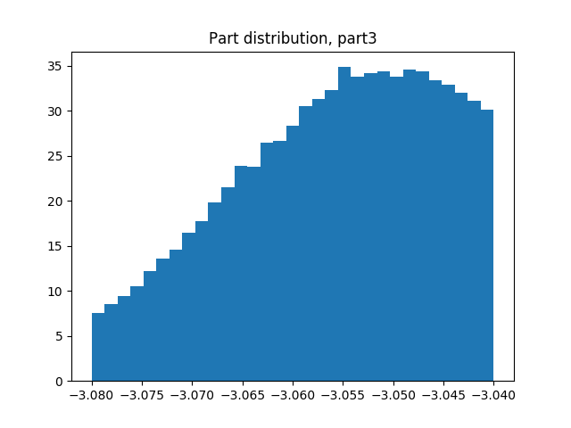
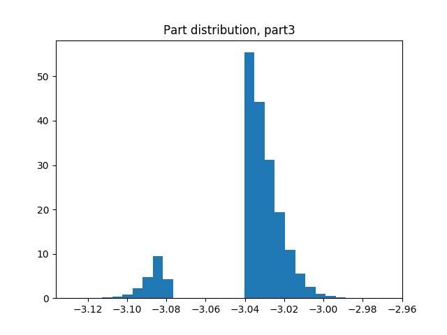
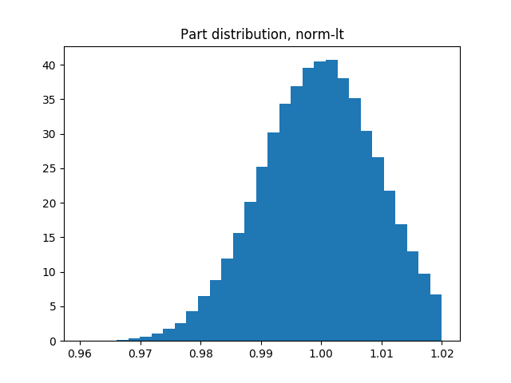

.. _distributions:

Distributions
=============

Normal
------

The most common distribution is the ``normal`` distribution.  When the user provides part tolerances, it is assumed
that the tolerances are :math:`\pm3\sigma`, which is to say that it encompasses about 99.7% of the range of parts.
In other words, if you provide a ``Part`` with the ``upper_tolerance=0.1``, then 99.7% of the parts will measure
the ``nominal_value`` :math:`\pm0.1`.

.. image::
   images/part-distribution-normal.png

Normal, Screened
----------------

Sometimes, the plant will implement some sort of screening process in order to ensure that parts that go to the
manufacturing floor absolutely conform to the minimum and maximum standards.  In this case, one or more "tails" of
the product distribution might be cut off.

Normal, Notched
---------------

It is also common for manufacturers of basic components to sort out the higher precision components and sell them for
a higher price.  If you are the recipient of the lower-spec component, you might observe a notched distribution in
which none of your components are close to nominal, but all of them meet the wider spec.

Normal, Less-Than
-----------------

If parts are screened to be less-than or greater-than a particular value, then one side is cut off.  This is a special
case of the screened distribution in which only one side is cut off.

.. image:: images/screenshot-dist-gt.png

