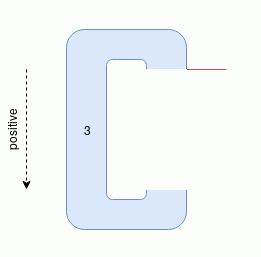
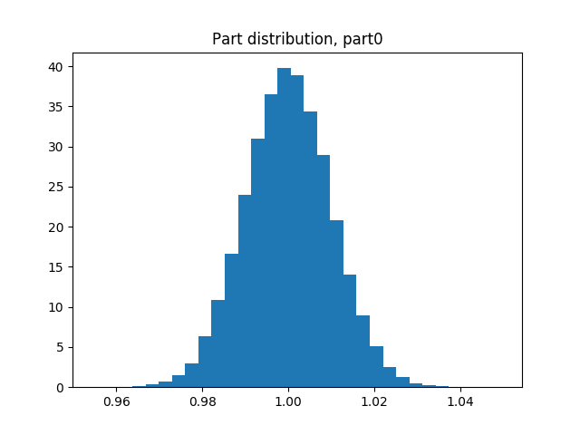
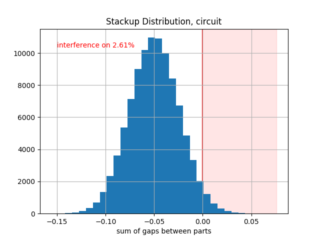
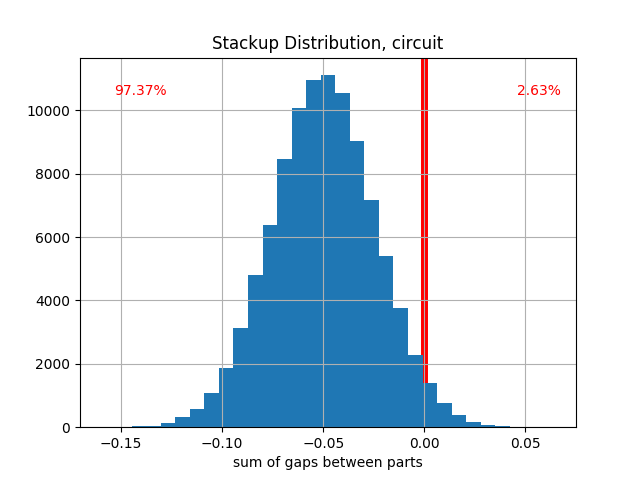
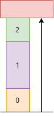
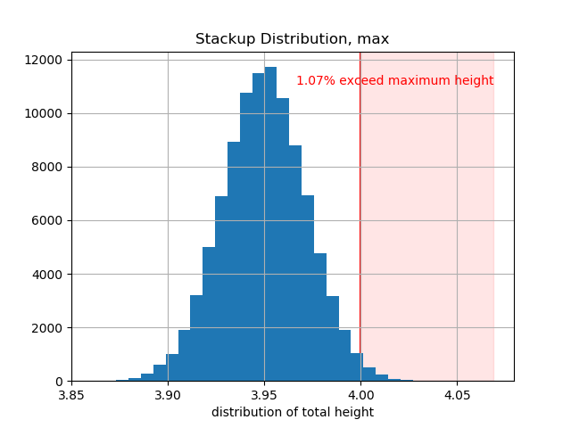
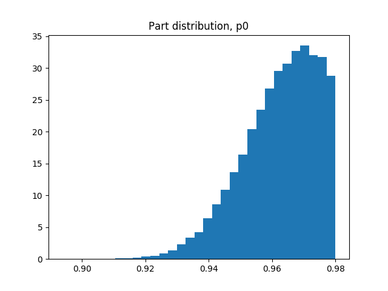
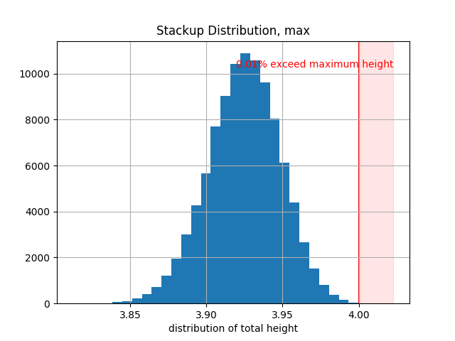

Usage
============

Tolerance Stackup Types
-----------------------

There are a few different tolerance stackup types that are currently supported:

 1. Circuit Stackup - A stackup that will generally add up to "0" or more.
 2. Max Height - A stackup that, when complete, will not exceed some number.
 3. Min Height = A stackup that, when complete, will not be under some number.

Circuit Stackup
---------------

The circuit stackup is the default type of tolerance stackup and will likely be familiar to most
readers who have experience with tolerance stackups.  An assembly such as the below C clamp
represents a circuit.  One chooses a reference and moves around the stack path, calculating tolerance
at each step in order to reach the beginning again.  All of this is automatically done for the user,
but the user must set up the correct positive direction and values.

First, we number the diagram so that we may have some sort of clean reference to the part.

Next, we choose a reference (the red line) and define the positive direction.  If a move is in the
positive direction, we will add the value and if it is in the negative direction, we will subtract
the value.

Starting at the reference, walk around one step at a time adding the value and tolerance to the
``Part``.  In these parts, part 0 has a length of 1.0, part 1 has a length of 2.0, and part 2 has
a length of -3.0.

Once the user has gotten to this point in the tolerance stack using ``tol-stack``, the distribution and
the interference should be apparent.  Assuming "line-to-line" values, all of these will add up to 0.0.

Now that we know what the tolerance stackup looks like, we can start coding.  First, import the
``tol_stack`` package components ``Part`` and ``StackPath``.

.. code-block:: python
   :linenos:
   :emphasize-lines: 1

   from tol_stack import Part, StackPath

For the moment, assume that the distribution of the part variance is normal.  We will discuss other
:ref:`distributions` that may commonly be encountered in manufacturing processes in another section.  We
create each ``Part`` with the nominal dimensions and with some tolerance value.

.. code-block:: python
   :linenos:
   :emphasize-lines: 3, 5, 6, 7

   from tol_stack import Part, StackPath

   size = 100000  # denotes size of the simulation

   p1 = Part(name='part1', nominal_value=1.0, upper_tolerance=0.05, size=size)
   p2 = Part(name='part2', nominal_value=2.0, upper_tolerance=0.05, size=size)
   p3 = Part(name='part3', nominal_value=-3.0, upper_tolerance=0.05, size=size)

At this point, if we wanted to see the distribution of the part variation, we could call the
``.show_dist()`` method of ``Part``.  This parameter takes all keyword arguments accepted by
`matplotlib.pyplot.Axes.hist() <https://matplotlib.org/3.1.1/api/_as_gen/matplotlib.axes.Axes.hist.html>`_.

.. code-block:: python
   :linenos:
   :emphasize-lines: 9

   from tol_stack import Part, StackPath

   size = 100000  # denotes size of the simulation

   p1 = Part(name='part1', nominal_value=1.0, upper_tolerance=0.05, size=size)
   p2 = Part(name='part2', nominal_value=2.0, upper_tolerance=0.05, size=size)
   p3 = Part(name='part3', nominal_value=-3.0, upper_tolerance=0.05, size=size)

   p1.show_dist(density=True, bins=31)

Finally, we create the ``StackPath`` and add each part to it, then run the ``analyze()`` method.  Once the analysis
is complete, we can call the ``.show_dist()`` method of the ``StackPath`` to show the percentage of units that are
expected to fall out of tolerance.

.. code-block:: python
   :linenos:
   :emphasize-lines: 9-11, 13, 14

   from tol_stack import Part, StackPath

   size = 100000  # denotes size of the simulation

   p1 = Part(name='part1', nominal_value=1.0, upper_tolerance=0.05, size=size)
   p2 = Part(name='part2', nominal_value=2.0, upper_tolerance=0.05, size=size)
   p3 = Part(name='part3', nominal_value=-3.0, upper_tolerance=0.05, size=size)

   sp = StackPath()
   sp.add_part(p1)
   sp.add_part(p2)
   sp.add_part(p3)

   sp.analyze()
   sp.show_dist(bins=31)

Based on the image, 50% of units are expected to crash!

Let's improve this situation.  We will change the 3.0 to 3.05 to see if the stackup changes.

.. code-block:: python
   :linenos:
   :emphasize-lines: 7

   from tol_stack import Part, StackPath

   size = 100000  # denotes size of the simulation

   p1 = Part(name='part1', nominal_value=1.0, upper_tolerance=0.05, size=size)
   p2 = Part(name='part2', nominal_value=2.0, upper_tolerance=0.05, size=size)
   p3 = Part(name='part3', nominal_value=-3.05, upper_tolerance=0.05, size=size)

   sp = StackPath()
   sp.add_part(p1)
   sp.add_part(p2)
   sp.add_part(p3)

   sp.analyze()
   sp.show_dist(bins=31)

Our final distribution now shows 97% of our parts will be OK.  Now we are in a realm in which we may want to, again,
change the dimension or we may wish to tighten one or more tolerance values.  One item of note is that the horizontal
axis is, both, positive and negative.  The user will be defining the positive and negative in each scenario.  In the
shown case, the "good" side is negative.  If we had defined the 3.0 dimension as positive and the other two as
negative, then the situation would have reversed.

Max Height Stackup
------------------

A maximum height stackup will help ensure that the stackup will not exceed a maximum height.

Creating the maximum height stackup is much like creating the circuit stackup.  THe crucial difference is that
all of the part values are positive and the ``StackPath`` is supplied with a ``path_type='max'`` parameter.

.. code-block:: python
   :linenos:
   :emphasize-lines: 9

   from tol_stack import Part, StackPath

   size = 100000  # denotes size of the simulation

   p0 = Part(name='part0', nominal_value=0.97, upper_tolerance=0.05, size=size)
   p1 = Part(name='part1', nominal_value=2.0, upper_tolerance=0.05, size=size)
   p2 = Part(name='part2', nominal_value=0.97, upper_tolerance=0.05, size=size)

   sp = StackPath(path_type='max', max_value=4.0)
   sp.add_part(p0)
   sp.add_part(p1)
   sp.add_part(p2)

   sp.analyze()
   sp.show_dist(bins=31)

When the parts 0, 1, and 2 are stacked up, the chances that they protrude into the red zone are shown
in the histogram.

In this case, about 1% of the parts will end up over the maximum value.  We will use this as an opportunity
to show an alternate distribution, which is the ``norm-lt`` distribution.  When specifying part 0 and part 2,
we specify the ``distribution='norm-lt'`` to indicate that manufacturing has implemented some sort of pass/fail
gage.  We must also specify the limit of the pass/fail gage.

.. code-block:: python
   :linenos:
   :emphasize-lines: 6, 9

   from tol_stack import Part, StackPath

   size = 100000  # denotes size of the simulation

   p0 = Part(name='part0', nominal_value=0.97, upper_tolerance=0.05, size=size,
             distribution='norm-lt', limits=0.99)
   p1 = Part(name='part1', nominal_value=2.0, upper_tolerance=0.05, size=size)
   p2 = Part(name='part2', nominal_value=0.97, upper_tolerance=0.05, size=size,
             distribution='norm-lt', limits=0.99)

   sp = StackPath(path_type='max', max_value=4.0)
   sp.add_part(p0)
   sp.add_part(p1)
   sp.add_part(p2)

   sp.analyze()
   sp.show_dist(bins=31)

You can confidently state that the screening that manufacturing has implemented is effective!

Min Height Stackup
------------------

A maximum height stackup will... (todo)