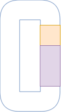
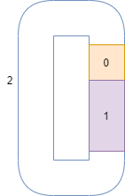
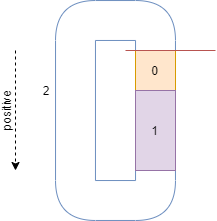
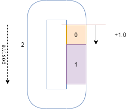
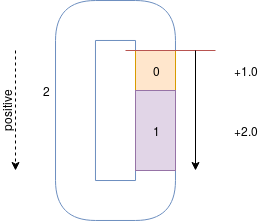
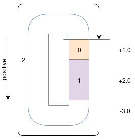

Usage
============

Tolerance Stackup Types
-----------------------

There are a few different tolerance stackup types that are currently supported:

 1. Circuit Stackup - A stackup that will generally add up to "0" or more.
 2. Max Height - A stackup that, when complete, will not exceed some number.
 3. Min Height = A stackup that, when complete, will not be under some number.

Circuit Stackup
---------------

The circuit stackup is the default type of tolerance stackup and will likely be familiar to most
readers who have experience with tolerance stackups.  An assembly such as the below C clamp
represents a circuit.  One chooses a reference and moves around the stack path, calculating tolerance
at each step in order to reach the beginning again.  All of this is automatically done for the user,
but the user must set up the correct positive direction and values.

First, we number the diagram so that we may have some sort of clean reference to the part.

Next, we choose a reference (the red line) and define the positive direction.  If a move is in the
positive direction, we will add the value and if it is in the negative direction, we will subtract
the value.

Starting at the reference, walk around one step at a time adding the value and tolerance to the
``Part``.  In these parts, part 0 has a length of 1.0, part 1 has a length of 2.0, and part 2 has
a length of -3.0.

Once the user has gotten to this point in the tolerance stack using ``tol-stack``, the distribution and
the apparent interference should be apparent.

.. image::
   images/screenshot-circuit.png

Max Height Stackup
------------------

A maximum height stackup will... (todo)

Min Height Stackup
------------------

A maximum height stackup will... (todo)