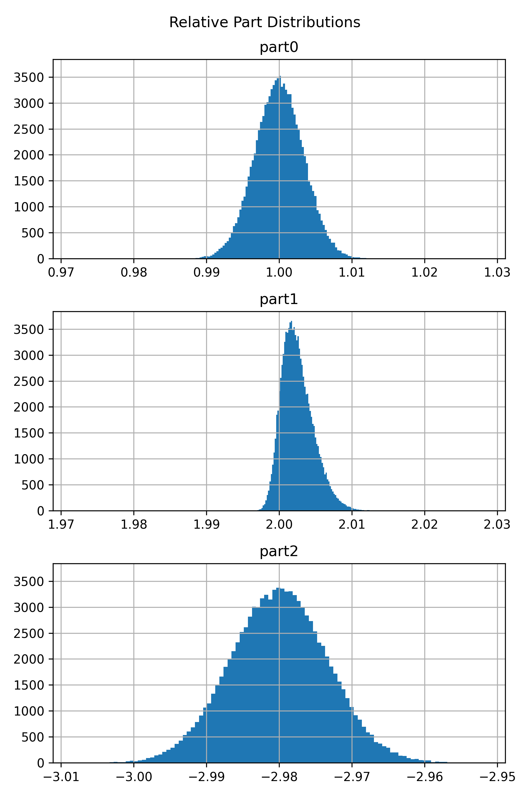
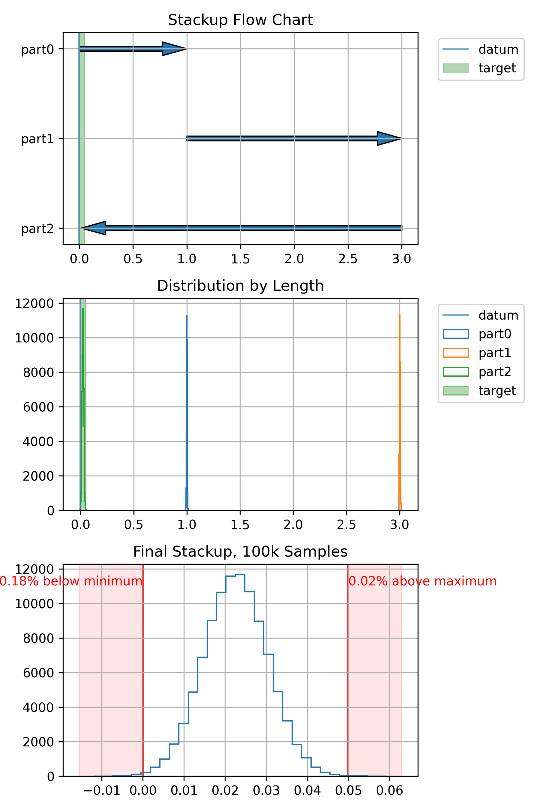
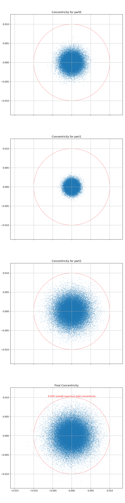

# Purpose

Library intended for easy mechanical tolerance analysis 
using Monte-Carlo-based simulation techniques.

## Gallery

### Length Stackup Analysis

Run the below script to display the plots below

    parts = [
        Part(name='part0',
             nominal_length=1.0,
             tolerance=0.01,
             size=size
            ),
        Part(name='part1',
             distribution='skew-norm',
             skewiness=3,
             nominal_length=2.0,
             tolerance=0.01,
             size=size
            ),
        Part(name='part2',
            nominal_length=-2.98,
            tolerance=0.02,
            concentricity=0.005,
            size=size
            )
    ]

    sp = StackPath(max_length=0.05, min_length=0.00, concentricity=0.05)
    for part in parts:
        sp.add_part(part)

    sp.show_part_relative_dists()
    sp.show_length_dist()

    plt.show()

### True Position Analysis

    parts = [
        Part(name='part0',
             concentricity=0.005,
             limits=1.02,
             size=size
             ),
        Part(name='part1',
             concentricity=0.003,
             limits=2.02,
             size=size
             ),
        Part(
            name='part2',
            concentricity=0.008,
            size=size
        )
    ]

    sp = StackPath(concentricity=0.01)
    for part in parts:
        sp.add_part(part)

    sp.show_concentricity_dist()

    plt.show()

## Installation

At the moment, the best scenario is to download a 
copy of this repository and execute directly.  More 
deployment options will be presented as the API matures.

## Project Maturity

The project API is not currently stable and will likely
continue to evolve until I like it.

### Feature Roadmap

 - ~~Single-dimension stackups~~ - The simplest and most common of 
 stackups; i.e. length. 
 - Concentricity stackups - Typically, center-to-center on a plane.
 - Material properties
   - Temperature-based stackup based on CTE of materials
 - Intuitive Python interface - This is currently being worked out.
 - Similar YAML interface - Should be readably compatible with the 
 Python interface.
 - Report generator  
 - Deployment as executable (command-line) YAML
 - Deployment as executable (GUI) ?
 - Deployment to PyPI?
